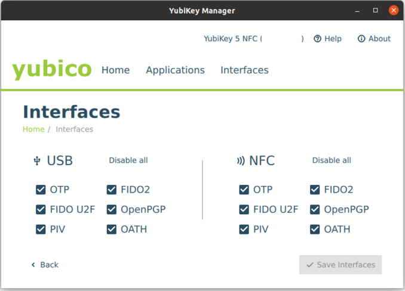
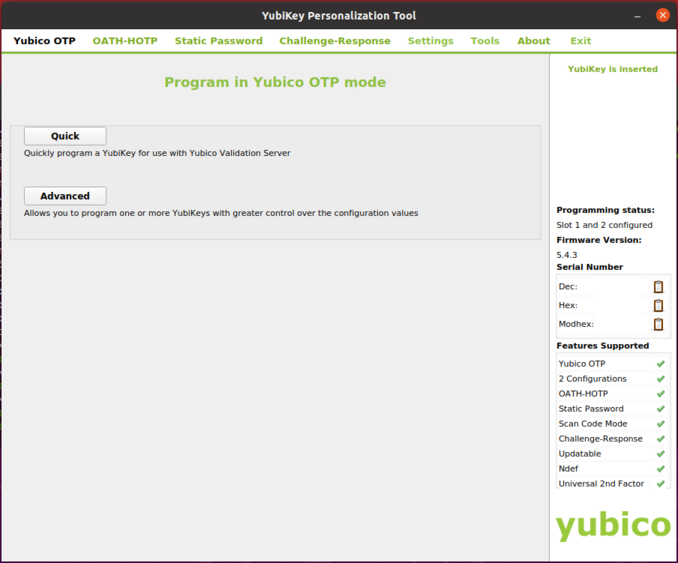

# Configure a Yubikey
By [Zidmann](mailto:emmanuel.zidel@gmail.com) :bow:

## Global presentation
Yubikey hardware can be configured thanks to two tools :
* YubiKey Manager
* YubiKey Personalization Tool

The first tool is simpler than the second, but the second one has more features.

For each of these tools, it exists a CLI (command line interface) and a GUI (graphical user interface) versions.

## Install CLI packages
```bash
# apt-get install yubikey-manager
# apt-get install yubikey-personalization
```

## Install GUI packages
```bash
# apt-get install yubikey-manager-qt
# apt-get install yubikey-personalization-gui
```

__YubiKey Manager Tool screenshot__



__YubiKey Personalization Tool screenshot__



## Useful CLI commands
Installing the CLI version of the tool packages provides these commands:
* ykman
* ykpersonalize

Installing the GUI version of the tool packages provides these commands:
* ykman-gui
* yubikey-personalization-gui

#### __See the Yubikeys__
```bash
> ykman list
 YubiKey 5 NFC (5.4.3) [OTP+FIDO+CCID] Serial: XXXXXXXX
```

### __See information on the YubiKeys__
```bash
> ykman info
 Device type: YubiKey X
 Serial number: XXXXXXXX
 Firmware version: 5.4.3
 Form factor: Keychain (USB-A)
 Enabled USB interfaces: OTP, FIDO, CCID
 NFC transport is enabled.

 Applications	USB    	NFC    
 FIDO2       	Enabled	Enabled	
 OTP         	Enabled	Enabled	
 FIDO U2F    	Enabled	Enabled	
 OATH        	Enabled	Enabled	
 YubiHSM Auth	Enabled	Enabled	
 OpenPGP     	Enabled	Enabled	
 PIV         	Enabled	Enabled	
```

### __Change the HMAC-SHA1 secret key__
HMAC-SHA1 is used for challenge response action and store a key inside.
To renew this key the command below is executed, with most of the type slot=2 :
```bash
> ykpersonalize -<slot> -ochal-resp -ochal-hmac -ohmac-lt64 -oserial-api-visible [-ochal-btn-trig] [-v]
```

The arguments above mean :

| Option | Description |
|--------|--------|
| -\<slot\> | Use slot 2  |
| -ochal-resp | Set Challenge-Response mode |
| -ochal-hmac | Generate HMAC-SHA1 challenge responses |
| -ohmac-lt64 | Calculate HMAC on less than 64 bytes input |
| -oserial-api-visible | Allow YubiKey serial number to be read using an API call |
| -ochal-btn-trig | Require touching YubiKey before issue response |
| -v | Verbose output |

**!! WARNING !!** If you have already configured a slot for HMAC-SHA1 challenge-response mode, the command will overwrite the previous secret key and the access to the devices will become unrecoverable.

## References
* https://docs.yubico.com/software/yubikey/tools/ykman/
* https://www.yubico.com/support/download/yubikey-manager/
* https://en.wikipedia.org/wiki/HMAC
* https://github.com/agherzan/yubikey-full-disk-encryption
